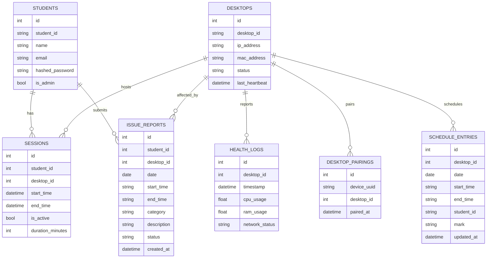
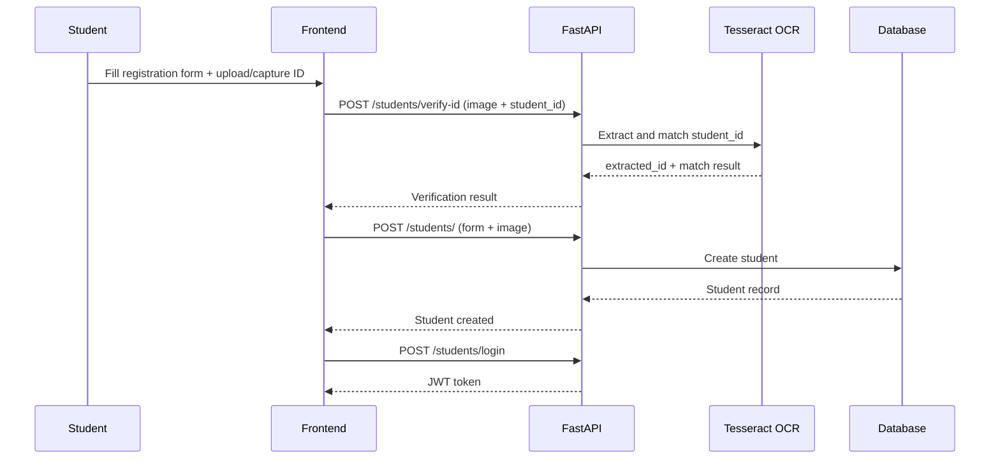
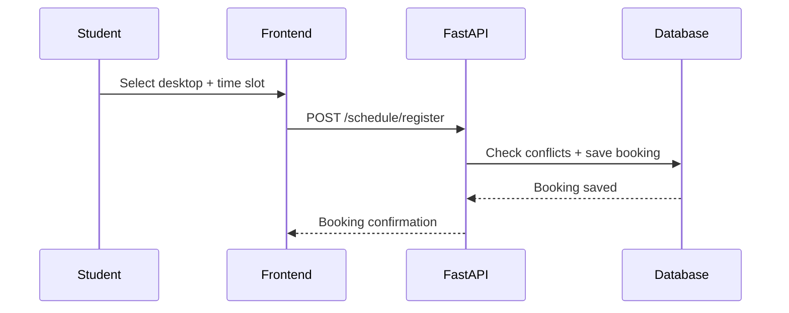
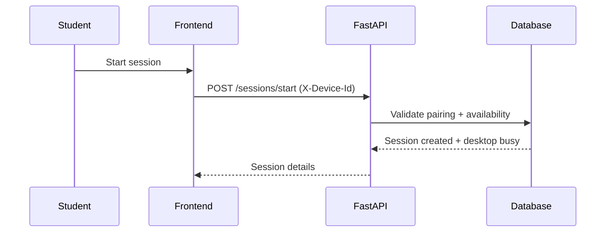
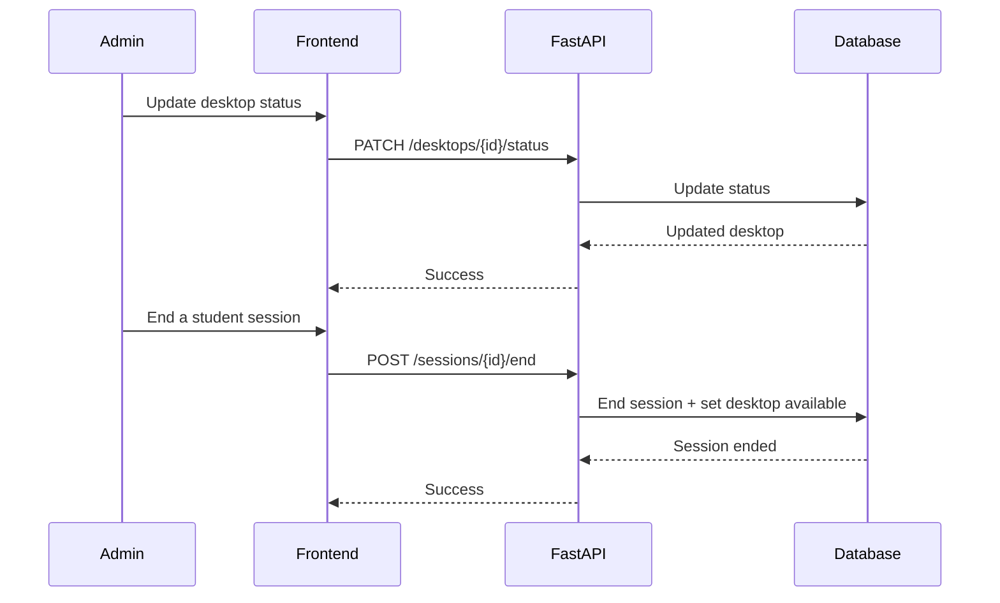
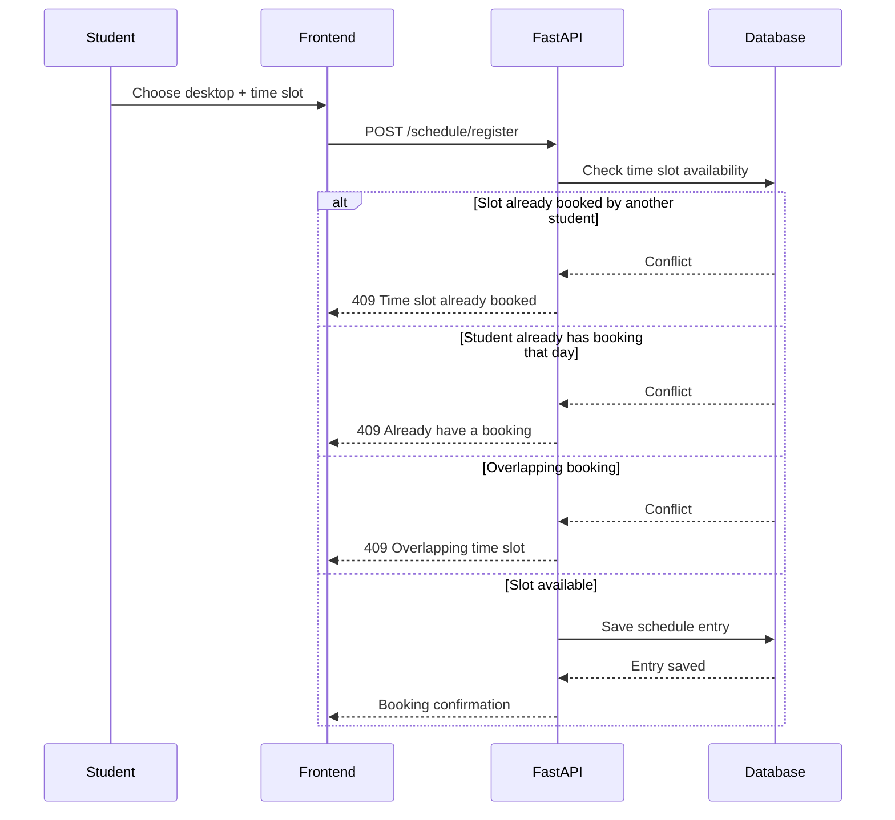

# AI-Based Desktop Pooling System - Project Resume

## 1) Project Summary

The AI-Based Desktop Pooling System (SDPMS) is a FastAPI + React application for managing shared library desktops. It supports student registration with ID verification, desktop booking, live session tracking, and admin monitoring. The AI/ML component uses OCR to verify student IDs from uploaded/captured images.

## 2) Goals

- Reduce queueing and manual desktop allocation.
- Ensure only verified students can reserve and use desktops.
- Provide admins with real-time visibility of usage and issues.
- Keep booking and session workflows simple and auditable.

## 3) Actors

- Student
- Admin/Librarian
- Desktop Agent (heartbeat sender)

## 4) System Architecture (High-Level)

```mermaid
graph LR
  Student[Student] -->|Web UI| FE[React/Vite Frontend]
  Admin[Admin/Librarian] -->|Web UI| FE
  FE -->|REST + JWT| API[FastAPI API]
  API --> DB[(SQL DB: SQLite or Postgres)]
  Agent[Desktop Agent] -->|Heartbeat| API
  API --> OCR[OCR Engine (Tesseract)]
```

## 5) Core Use Cases

```mermaid
graph TD
  Student((Student)) --> UC1[Register account with ID OCR]
  Student --> UC2[Login (student)]
  Student --> UC3[Pair device to desktop]
  Student --> UC4[Book a time slot]
  Student --> UC5[Start desktop session]
  Student --> UC6[End session]
  Student --> UC7[Report issue]

  Admin((Admin)) --> UA1[Login (admin)]
  Admin --> UA2[Manage desktops]
  Admin --> UA3[Monitor sessions]
  Admin --> UA4[View issue reports]
  Admin --> UA5[View analytics]

  Agent((Desktop Agent)) --> UH1[Send heartbeat]
```

## 6) Main Data Model

- Student: id, student_id, name, email, hashed_password, is_admin
- Desktop: id, desktop_id, ip_address, mac_address, status, last_heartbeat
- Session: id, student_id, desktop_id, start_time, end_time, is_active, duration_minutes
- DesktopPairing: device_uuid, desktop_id, paired_at
- ScheduleEntry: desktop_id, date, start_time, end_time, student_id, mark
- IssueReport: desktop_id, student_id, date, time range, category, description, status

### 6.1 ER Diagram (Mermaid)



## 7) AI/ML Component (OCR Verification)

- Purpose: Confirm the student ID on an uploaded or camera-captured university ID.
- Engine: Tesseract OCR via `pytesseract`.
- Flow:
  - Normalize image orientation.
  - Preprocess (grayscale, contrast, median filter, thresholding).
  - Run OCR with whitelist (`UGRugr0123456789/`).
  - Normalize and extract candidate IDs using a regex pattern.
  - Match against expected `ugr/NNNNN/NN` format.

## 8) Key API Capabilities

- Auth: `/token`, `/students/login`, `/me`
- Student: `/students/`, `/students/verify-id`
- Desktops: `/desktops/`, `/desktops/overview`, `/desktops/{id}/status`
- Sessions: `/sessions/start`, `/sessions/me`, `/sessions/active`, `/sessions/{id}/end`
- Pairing: `/pairings/register`
- Schedule: `/schedule`, `/schedule/register`, `/schedule/entry`
- Issues: `/issues/report`, `/issues`
- Analytics: `/analytics/stats`
- Agent heartbeat: `/agent/heartbeat`

## 9) Sequence Diagrams (High-Level)

### 9.1 Student Registration with OCR



### 9.2 Schedule Booking (Student)



### 9.3 Start Session (Device Pairing Required)



### 9.4 Admin Management (Status + End Session)



### 9.5 Schedule Booking with Conflict Handling



### 9.6 Issue Reporting (Authorized Booking)

```mermaid
sequenceDiagram
  participant S as Student
  participant FE as Frontend
  participant API as FastAPI
  participant DB as Database

  S->>FE: Submit issue report
  FE->>API: POST /issues/report
