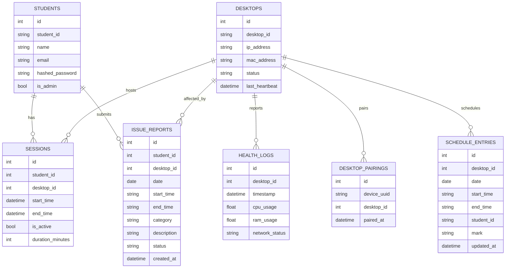
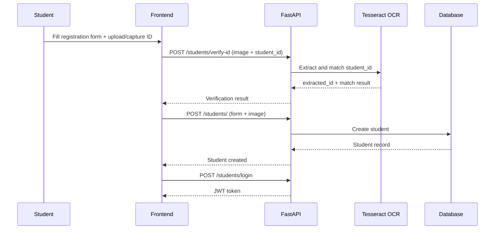
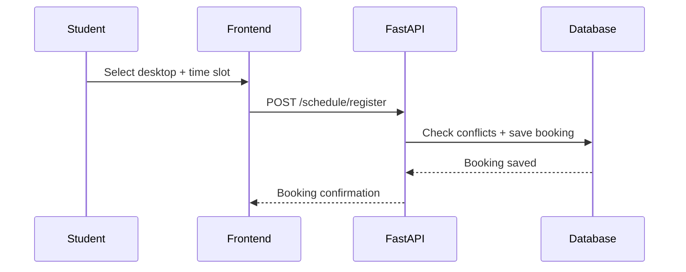
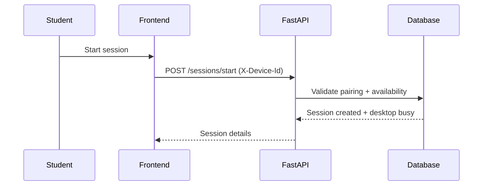
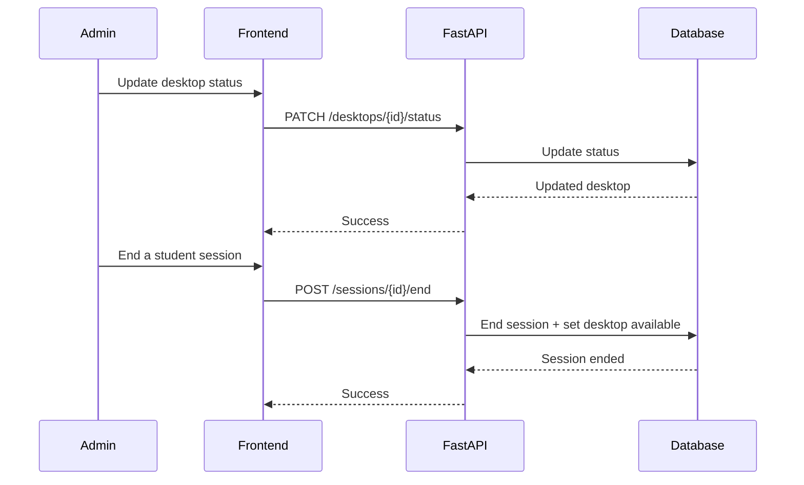
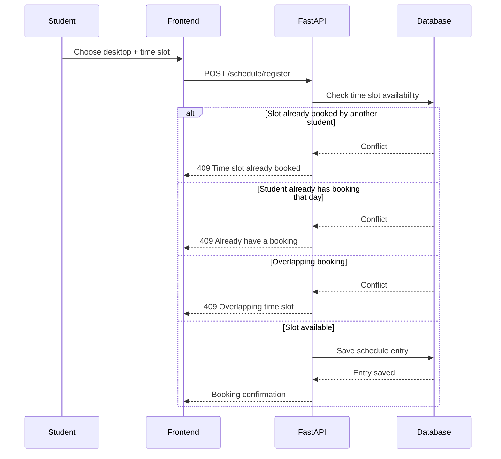
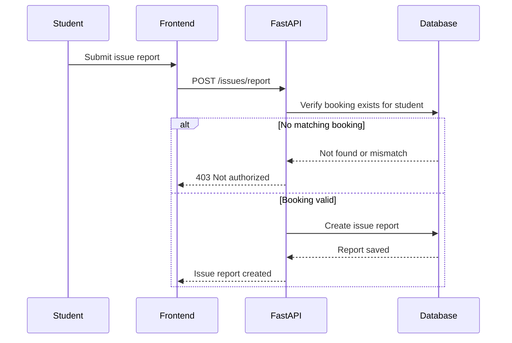

# AI-Based Desktop Pooling System (SDPMS)

SDPMS is a FastAPI + React system for managing shared library desktops. It supports student registration with ID verification, desktop booking, live session tracking, and admin monitoring. The AI/ML component uses OCR to verify student IDs from uploaded or camera-captured images.

## Table of Contents

- Overview
- Features
- Actors
- System Architecture
- Use Cases
- Data Model and ER Diagram
- Sequence Diagrams
- AI/ML Component
- Key API Capabilities
- Getting Started
- Security and Access Control
- Deployment Notes
- Scope and Limitations

## Overview

- Reduce queueing and manual desktop allocation.
- Ensure only verified students can reserve and use desktops.
- Provide admins with real-time visibility of usage and issues.
- Keep booking and session workflows simple and auditable.

## Features

- Student registration with ID OCR verification
- Desktop pairing to a device for trusted session start
- Time-slot booking with conflict checks
- Live session tracking and admin monitoring
- Issue reporting linked to valid bookings

## Actors

- Student
- Admin/Librarian
- Desktop Agent (heartbeat sender)

## System Architecture

```mermaid
graph LR
  Student[Student] -->|Web UI| FE[React/Vite Frontend]
  Admin[Admin/Librarian] -->|Web UI| FE
  FE -->|REST + JWT| API[FastAPI API]
  API --> DB[(SQL DB: SQLite or Postgres)]
  Agent[Desktop Agent] -->|Heartbeat| API
  API --> OCR[OCR Engine (Tesseract)]
```

## Use Cases

```mermaid
graph TD
  Student((Student)) --> UC1[Register account with ID OCR]
  Student --> UC2[Login (student)]
  Student --> UC3[Pair device to desktop]
  Student --> UC4[Book a time slot]
  Student --> UC5[Start desktop session]
  Student --> UC6[End session]
  Student --> UC7[Report issue]

  Admin((Admin)) --> UA1[Login (admin)]
  Admin --> UA2[Manage desktops]
  Admin --> UA3[Monitor sessions]
  Admin --> UA4[View issue reports]
  Admin --> UA5[View analytics]

  Agent((Desktop Agent)) --> UH1[Send heartbeat]
```

## Data Model and ER Diagram

- Student: id, student_id, name, email, hashed_password, is_admin
- Desktop: id, desktop_id, ip_address, mac_address, status, last_heartbeat
- Session: id, student_id, desktop_id, start_time, end_time, is_active, duration_minutes
- DesktopPairing: device_uuid, desktop_id, paired_at
- ScheduleEntry: desktop_id, date, start_time, end_time, student_id, mark
- IssueReport: desktop_id, student_id, date, time range, category, description, status



## AI/ML Component (OCR Verification)

- Purpose: Confirm the student ID on an uploaded or camera-captured university ID.
- Engine: Tesseract OCR via `pytesseract`.
- Flow:
  - Normalize image orientation.
  - Preprocess (grayscale, contrast, median filter, thresholding).
  - Run OCR with whitelist (`UGRugr0123456789/`).
  - Normalize and extract candidate IDs using a regex pattern.
  - Match against expected `ugr/NNNNN/NN` format.

## Key API Capabilities

- Auth: `/token`, `/students/login`, `/me`
- Student: `/students/`, `/students/verify-id`
- Desktops: `/desktops/`, `/desktops/overview`, `/desktops/{id}/status`
- Sessions: `/sessions/start`, `/sessions/me`, `/sessions/active`, `/sessions/{id}/end`
- Pairing: `/pairings/register`
- Schedule: `/schedule`, `/schedule/register`, `/schedule/entry`
- Issues: `/issues/report`, `/issues`
- Analytics: `/analytics/stats`
- Agent heartbeat: `/agent/heartbeat`

## Sequence Diagrams

### Student Registration with OCR



### Schedule Booking (Student)



### Start Session (Device Pairing Required)



### Admin Management (Status + End Session)



### Schedule Booking with Conflict Handling



### Issue Reporting (Authorized Booking)



## Getting Started

### Prerequisites

- Python 3.12+ (venv recommended)
- Node.js 18+
- Tesseract OCR installed or `TESSERACT_CMD` set

### Backend

```bash
python -m venv .venv
.venv/Scripts/activate
pip install -r requirements.txt
python -m uvicorn backend.main:app --reload --host 0.0.0.0 --port 8000
```

### Frontend

```bash
npm --prefix frontend install
npm --prefix frontend run dev
```

### Environment Variables

- `DATABASE_URL`: Postgres or SQLite connection string
- `SECRET_KEY`: JWT signing key
- `ACCESS_TOKEN_EXPIRE_MINUTES`: JWT expiration in minutes
- `CORS_ORIGINS`: comma-separated list of allowed origins
- `TESSERACT_CMD`: path to Tesseract binary
- `VITE_API_URL`: frontend API base URL

## Security and Access Control

- JWT-based auth for both student and admin sessions.
- Admin-only endpoints guarded by `is_admin`.
- Student endpoints check ownership of sessions and bookings.
- Desktop pairing enforces device-level trust for session start.

## Deployment Notes

- Backend supports SQLite (default) and Postgres via `DATABASE_URL`.
- CORS is configurable via `CORS_ORIGINS`.
- OCR requires Tesseract installed or `TESSERACT_CMD` set.
- Frontend uses Vite; API URL via `VITE_API_URL`.

## Scope and Limitations

- AI/ML is limited to OCR verification; no predictive allocation model.
- Scheduling is daily and time-slot based.
- Desktop agent only reports heartbeat status (no full telemetry upload).
